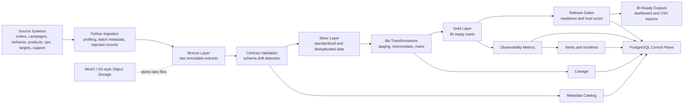
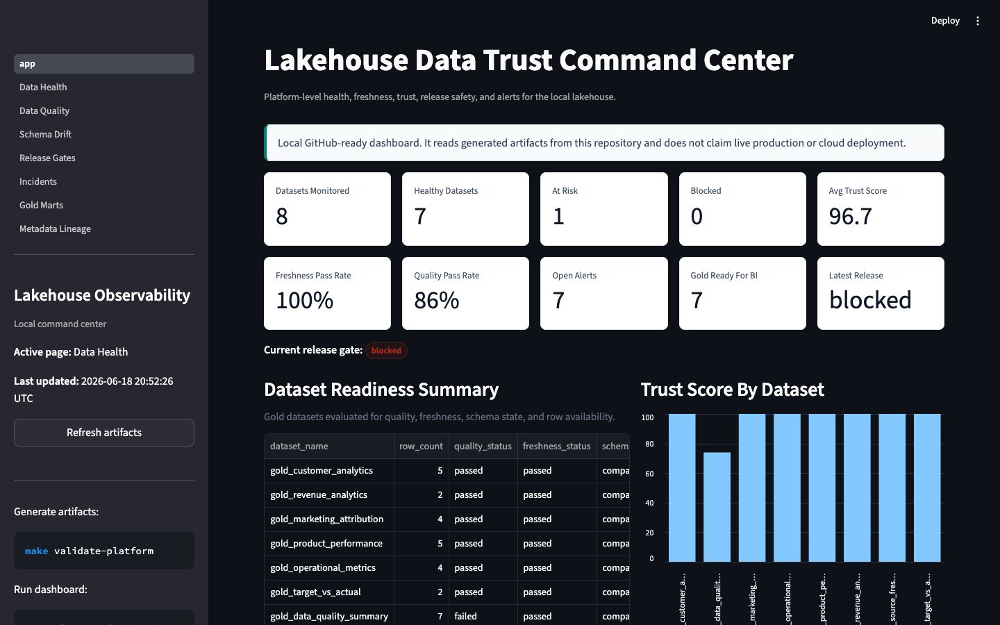
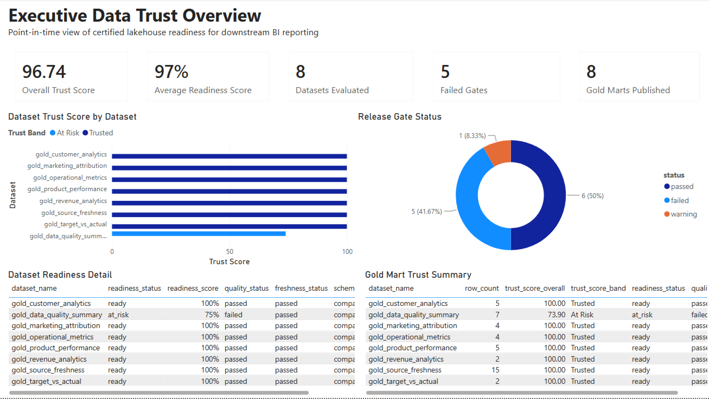
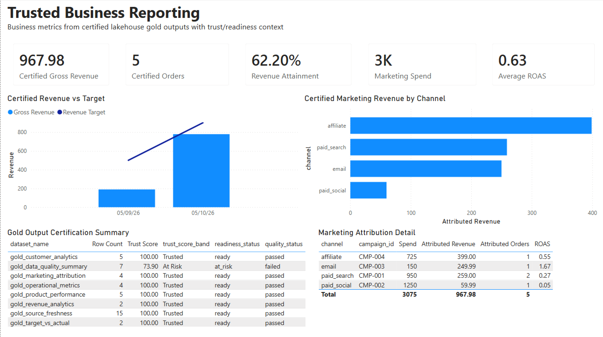
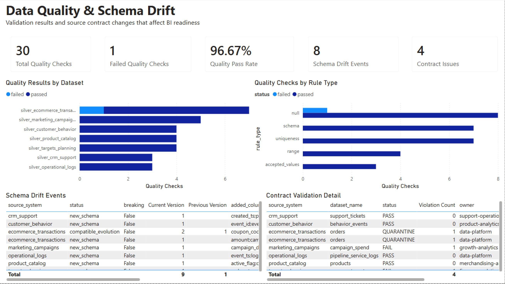
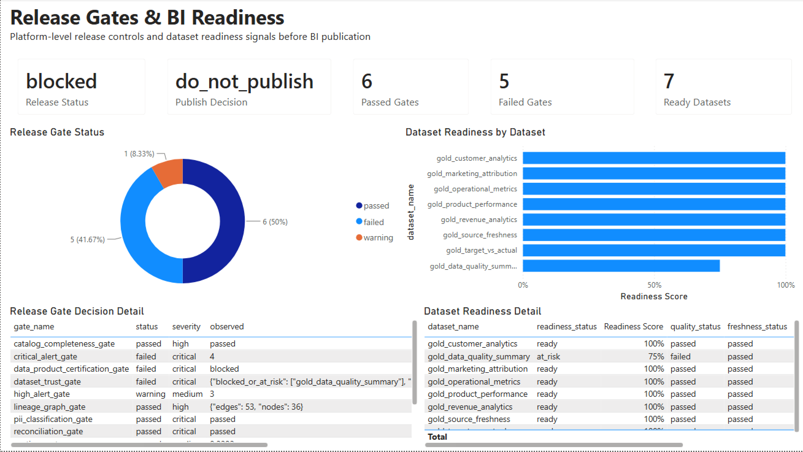
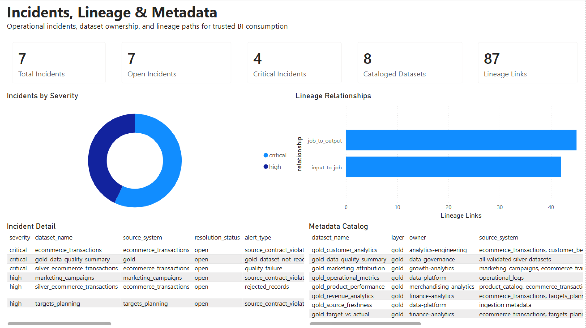

# Cloud Data Lakehouse & Data Observability Platform

[](https://github.com/darshil-mangukiya/cloud-lakehouse-observability/actions/workflows/local-ci.yml)


## One-Line Summary

A production-style lakehouse platform with observability and governance controls that helps prevent unreliable data from reaching BI dashboards.

## What This Project Solves

Fast-growing SaaS and ecommerce teams often outgrow ad hoc analytics pipelines. Dashboards break when source schemas change, ETL jobs fail silently, freshness is unclear, duplicate data spreads across systems, and analysts lose trust in reporting outputs.

This project demonstrates a local, production-style data platform that ingests multi-source data, preserves raw evidence, validates contracts, detects schema drift, standardizes datasets, publishes trusted gold marts, and records observability signals before data is considered safe for BI consumption.

## Architecture Overview



PostgreSQL acts as the local control plane for metadata, alerts, schema state, observability records, and release-gate decisions. MinIO simulates S3-style object storage for lakehouse files.

## Core Features

- Multi-source ingestion for ecommerce transactions, marketing campaigns, customer behavior, product catalog, operational logs, planning targets, and support data.
- Bronze, silver, and gold lakehouse layering.
- Partitioned Parquet lakehouse output pattern under ignored local storage folders when a Parquet engine is available.
- Source contracts, schema fingerprinting, schema drift detection, and rejected record handling.
- Simulated paginated API ingestion example for support data beyond static files.
- Airflow DAGs for ingestion, validation, transformation, alerting, and reporting workflows.
- dbt staging, intermediate, and mart models with macros and tests.
- Lightweight dbt fact/dimension views for mart grain clarity.
- Great Expectations-style validation for schema, nulls, duplicates, accepted values, freshness, and row-count checks.
- Metadata catalog and lineage references for ownership, refresh expectations, downstream usage, and dataset criticality.
- Observability outputs for freshness, source health, quality status, incidents, trust score, and release gates.
- Optional PySpark daily revenue transformation example for a heavier processing path.
- BI-ready gold marts and curated sample outputs for GitHub review.
- Docker-based local reproducibility.

## Tech Stack

| Layer | Tools |
|---|---|
| Language | Python, SQL |
| Storage | MinIO / S3-style object storage, local lake folders |
| Warehouse and control plane | PostgreSQL |
| Orchestration | Apache Airflow |
| Transformation | dbt |
| Optional processing example | PySpark job, skipped gracefully when PySpark is not installed |
| Validation | Great Expectations-style checks, Python unit tests |
| Observability | readiness reports, trust scores, alerts, incidents, release gates |
| Dashboard | Streamlit observability dashboard, Power BI trusted reporting layer, BI-ready CSV exports |
| Reproducibility | Docker Compose, Makefile, GitHub Actions |

## Repository Structure

```text
cloud-lakehouse-observability/
  ingestion/          # ingestion, profiling, contracts, schema registry
  ingestion/api_sources/ # simulated paginated API ingestion example
  lakehouse/          # partitioned Parquet storage helpers
  spark/              # optional PySpark transformation example
  airflow/            # Airflow DAGs
  dbt/                # staging, intermediate, mart models, macros, tests
  data_quality/       # validation and reconciliation checks
  observability/      # freshness, readiness, trust score, SLOs, metrics
  metadata/           # catalog, audit, control coverage helpers
  alerts/             # alert creation and notification routing
  dashboards/         # Streamlit monitoring dashboard
  powerbi/            # Power BI trusted reporting layer, exports, screenshots
  lineage/            # lineage event and graph generation
  operations/         # release gates and operational controls
  sql/                # PostgreSQL schema setup
  sample_outputs/     # curated reviewer examples
  scripts/            # audit, local CI, CLI utilities
  tests/              # unit and smoke tests
  docs/               # GitHub reviewer and local execution docs
  docker/             # service Dockerfiles
```

## How To Run Locally

```bash
cp .env.example .env
python3 -m pip install -r requirements.txt
make run-pipeline
```

Generate the Power BI trusted reporting exports (optional, after a pipeline run):

```bash
python scripts/export_for_powerbi.py
```

Run the dashboard:

```bash
make dashboard
```

### Streamlit Observability Dashboard

The Streamlit dashboard is a local command center for data health, quality checks, schema drift, release gates, alerts/incidents, gold marts, metadata, and lineage.

```bash
streamlit run dashboards/streamlit/app.py
```

Run the Docker stack:

```bash
docker compose up --build
```

The credentials in `.env.example` and the fallback values in `docker-compose.yml` are for local Docker development only and must not be used in production.

Local service URLs:

| Service | URL |
|---|---|
| Airflow | `http://localhost:8080` |
| MinIO console | `http://localhost:9001` |
| Streamlit dashboard | `http://localhost:8501` |
| PostgreSQL | `localhost:5432`, database `lakehouse` |

### dbt Execution Note

The default dbt profile uses `postgres` as the Docker network hostname. For host-machine dbt runs, set `POSTGRES_HOST=localhost` when PostgreSQL is exposed on your machine, or run dbt inside the Docker Compose network.

## How To Validate

Run the main validation gate:

```bash
make validate-platform
```

Useful focused checks after a pipeline run:

```bash
python3 -B scripts/platform_audit.py
python3 -B -m unittest tests/test_contract_validator.py tests/test_dataset_trust.py
python3 -B -m py_compile $(find . -name "*.py" -not -path "./.venv/*" -not -path "./venv/*")
```

`make validate-platform` runs the smoke pipeline, unit tests, and platform audit. The unit test suite includes Power BI export validation:

```bash
python -m unittest tests/test_export_for_powerbi.py
```

## Sample Outputs

Curated examples are kept in `sample_outputs/` so reviewers can inspect platform behavior without running every service.

| Sample | What It Shows |
|---|---|
| `sample_release_gate_decision.md` | Whether gold data is safe for BI publication |
| `sample_schema_drift_event.md` | Detected source schema change and contract response |
| `sample_data_quality_report.md` | Quality checks and failed-record handling |
| `sample_dataset_readiness_report.md` | Gold dataset readiness signals |
| `sample_incident_summary.md` | Alert and incident workflow |
| `sample_gold_mart_preview.csv` | BI-ready gold mart preview |
| `sample_lineage_graph.md` | Source-to-gold lineage summary |

## Dashboard Screenshots

The local Streamlit observability dashboard shows dataset health, quality checks, schema drift, alerts, release gates, gold marts, metadata, and lineage.



| View | Screenshot |
|---|---|
| Data Health Command Center | [View](docs/assets/screenshots/data-health-command-center.png) |
| Data Quality | [View](docs/assets/screenshots/data-quality.png) |
| Schema Drift | [View](docs/assets/screenshots/schema-drift.png) |
| Release Gates | [View](docs/assets/screenshots/release-gates.png) |
| Alerts And Incidents | [View](docs/assets/screenshots/alerts-incidents.png) |
| Gold Marts And BI Outputs | [View](docs/assets/screenshots/gold-marts-bi-outputs.png) |
| Metadata And Lineage | [View](docs/assets/screenshots/metadata-lineage.png) |

See the [screenshot guide](docs/screenshots/README.md) for what each view demonstrates and how the images were reproduced locally.

## Power BI Trusted Reporting Layer

This project includes a Power BI reporting layer that consumes generated lakehouse gold outputs and observability exports from `powerbi/sample_exports/`. This dashboard is built from reproducible CSV exports generated from P5 runtime artifacts and gold marts.

Streamlit remains the platform observability dashboard. Power BI demonstrates how generated, trust-scored lakehouse outputs can support business reporting after release-gate evaluation.

The Power BI dashboard includes five pages:

1. Executive Data Trust Overview
2. Trusted Business Reporting
3. Data Quality & Schema Drift
4. Release Gates & BI Readiness
5. Incidents, Lineage & Metadata

Dashboard file: `powerbi/P5_Lakehouse_Data_Trust_Observability.pbix`

Regenerate the Power BI exports with:

```bash
python pipelines/run_platform.py --reset
python scripts/export_for_powerbi.py
```

The export script writes Power BI-ready CSVs to `powerbi/sample_exports/`. To open the dashboard, launch Power BI Desktop and open the `.pbix` file above; its tables load from the CSVs in `powerbi/sample_exports/`. See [powerbi/README.md](powerbi/README.md) for the data model and page details.

| Executive Data Trust Overview | Trusted Business Reporting |
|---|---|
|  |  |

| Data Quality & Schema Drift | Release Gates & BI Readiness |
|---|---|
|  |  |

| Incidents, Lineage & Metadata |
|---|
|  |

The dashboard is point-in-time and does not fabricate time-series history. Release gates are platform-level, while dataset trust and readiness scores are dataset-level. It is a local reporting layer built on simulated SaaS/ecommerce data — not a live Power BI Service deployment, scheduled refresh, or connection to a real warehouse.

## Key Gold Datasets

| Dataset | Purpose |
|---|---|
| `gold_customer_analytics` | Customer revenue, engagement, support, and retention signals |
| `gold_revenue_analytics` | Daily revenue, orders, refunds, failures, and targets |
| `gold_marketing_attribution` | Campaign spend, attributed revenue, orders, and ROAS |
| `gold_product_performance` | Product and category performance |
| `gold_operational_metrics` | Pipeline and service health indicators |
| `gold_target_vs_actual` | Actual revenue and order volume versus planning targets |
| `gold_data_quality_summary` | Quality status and failed checks |
| `gold_source_freshness` | Source recency, row counts, and schema versions |

## Notes About Local Simulation

This is a portfolio implementation that uses simulated SaaS/ecommerce data and local infrastructure. MinIO represents S3-style object storage, PostgreSQL represents the warehouse and platform control plane, and generated runtime artifacts are ignored by Git. Curated outputs are tracked only when they help explain the system during GitHub review.

The cloud deployment path is documented in [docs/cloud_deployment_path.md](docs/cloud_deployment_path.md) as a production extension, not as a live deployed environment.

Dependency ranges favor compatibility across local development environments. A production deployment should validate and lock exact package versions in its release process.

## License

This project is available under the [MIT License](LICENSE).

## Final Positioning Statement

This platform makes lakehouse data reliable, observable, governed, and safe for BI consumption.
