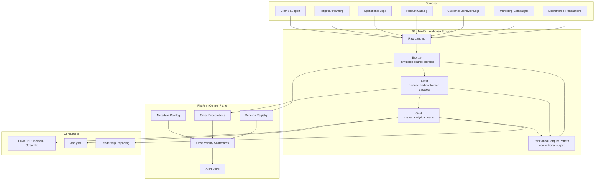

# Lakehouse Architecture

The design separates data movement from the platform control plane. Data artifacts live in lakehouse layers; operational truth lives in metadata, catalog, quality, observability, and alert tables.

Local lakehouse storage supports CSV/JSON source samples and partitioned Parquet output patterns for cloud-style object storage. The repository also includes one optional PySpark transformation job and one simulated API ingestion source; both are local examples and do not change the core Python/dbt/Docker runtime.
