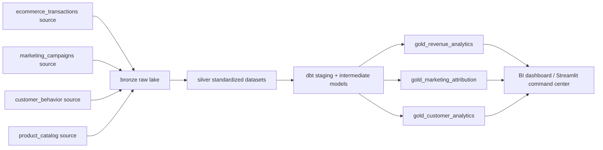

# Sample Lineage Graph

## Blast Radius Example

If `ecommerce_transactions` fails contract validation, revenue, customer, product, marketing attribution, and target-vs-actual marts are all considered at risk.
